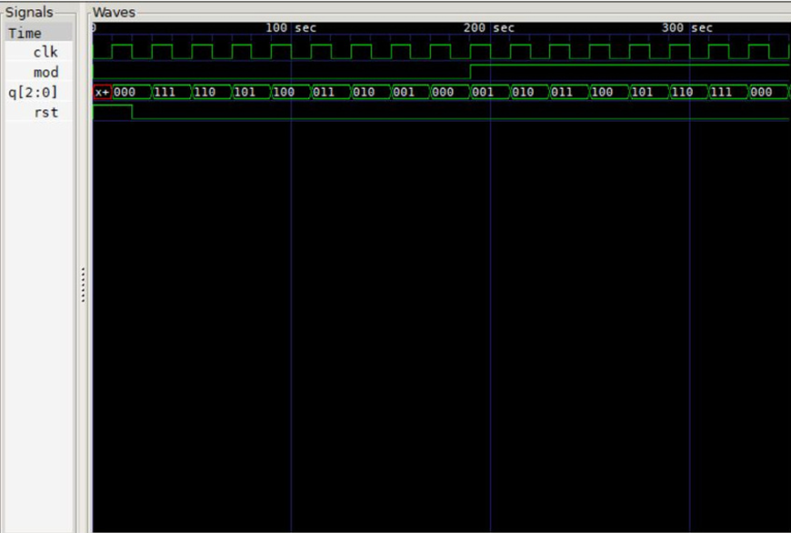
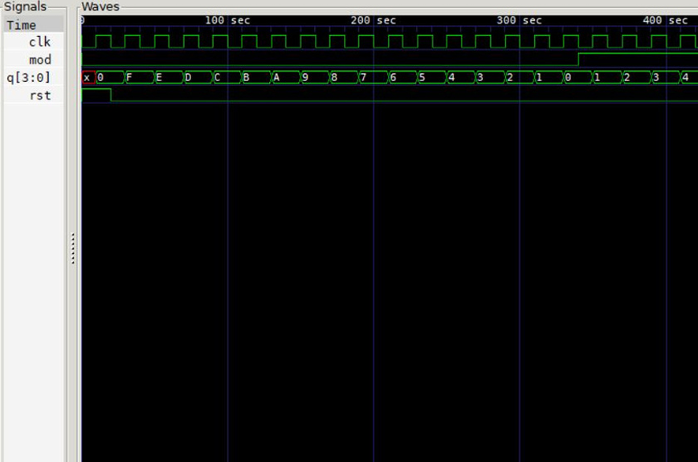

# Up/Down N-bit Counter (Icarus Verilog)

This project implements a **generalized, parameterized N-bit up/down counter** using **Icarus Verilog (iverilog)**.  
The counter width can be changed easily using a parameter, allowing the design to scale to **any number of bits (N bits)**.

The **testbench provided in this repository currently demonstrates 3‑bit and 4‑bit counters**, but users can generate counters of any size simply by modifying the `parameter N` value inside the testbench.

The counter direction depends on a `mode` input:
- `mode = 0` → **Up Counter**  
- `mode = 1` → **Down Counter**

---

## 🔧 Features
- Fully **parameterized N‑bit counter**
- Modify counter size simply by changing a **parameter** in the testbench
- Up/Down control using a single mode signal
- Synchronous clocked design
- Reset functionality
- Fully synthesizable Verilog
- Works seamlessly with **iverilog + GTKWave**

---

## 📁 Example Waveforms

### 3-bit Counter Output  


### 4-bit Counter Output  


---

## 🚀 How to Use

### **Adjust Counter Size (Generalized N-bit Counter)**
Inside the testbench:
```verilog
parameter:- #(3)   // Change this to any value (e.g., 8, 16, 32)
```

### **Compile**
```
iverilog -o counter N-bit_module.v 3_bit_tb.v
```

### **Run**
```
vvp counter
```

### **View Waveform**
```
gtkwave counter.vcd
```

---

## 🌟 Future Expansion
This counter system can be expanded into real-world applications such as:

- **Mall footfall counting**  
  Track daily visitors and live occupancy.

- **Factory production monitoring**  
  Count produced items and record defective items separately.

- **General statistics counters**  
  Any environment needing accurate event counting.

---

This project is open for anyone to use, learn from, or modify! ✨
